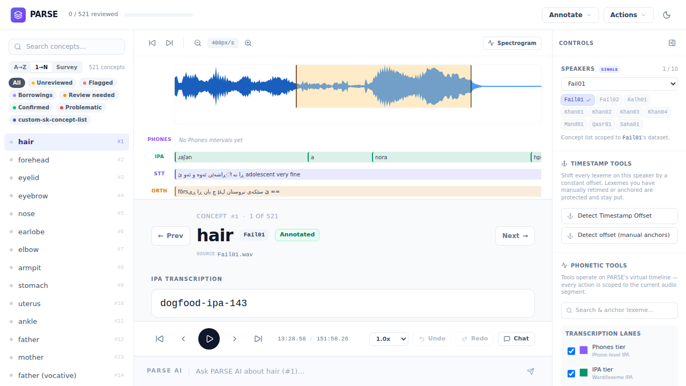
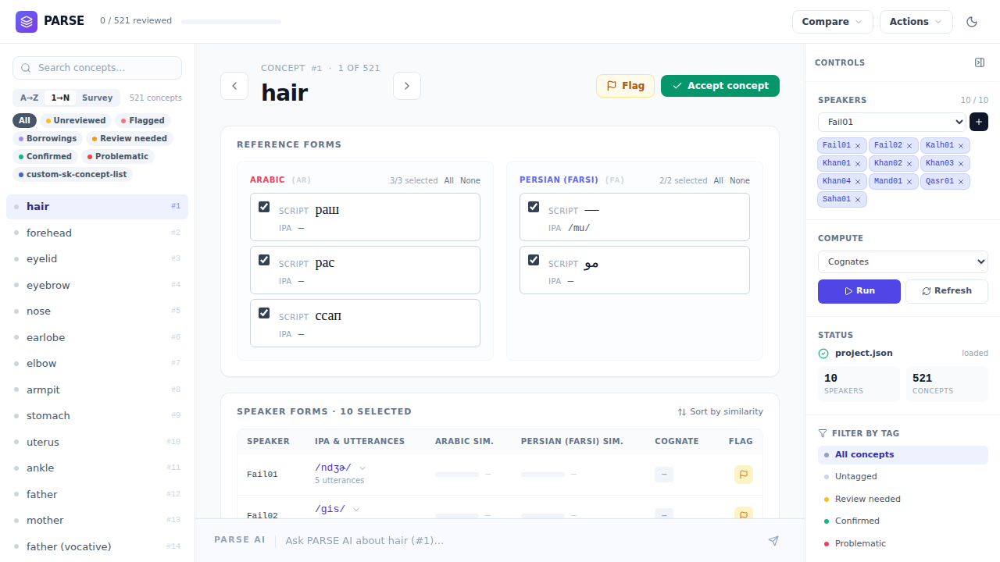

# PARSE — Phonetic Analysis & Review Source Explorer

[](LICENSE)
[](https://github.com/ArdeleanLucas/PARSE/actions/workflows/ci.yml)


**Browser-based dual-mode workstation for linguistic fieldwork.**
Annotate per-speaker recordings with tiered IPA/orthography, then compare across speakers for cognate adjudication, borrowing detection, and export-ready historical-linguistic datasets.

<p align="center">
  
  
</p>

> **Status**: Active development. Thesis-critical features are landing frequently, interfaces and file contracts are still evolving, and PARSE should currently be treated as research software rather than beta software.

## The Problem
Linguistic fieldwork, cognate adjudication, and phylogenetic export usually sprawl across disconnected tools. That fragmentation breaks timestamp fidelity, duplicates cleanup work, and makes audit trails brittle. PARSE keeps transcription, comparison, borrowing evidence, and export in one workspace.

## Who This Is For
Fieldwork linguists, comparative phylogenetics researchers, and low-resource language-documentation teams. It is built for workflows that need tiered IPA annotation, cross-speaker comparison, and LingPy/NEXUS export without leaving the same workstation.

## Table of Contents
- [What Makes PARSE Different](#what-makes-parse-different)
- [Quick Start](#quick-start)
- [Annotate](#annotate)
- [Compare](#compare)
- [AI Workflow Assistant](#ai-workflow-assistant)
- [MCP & External API](#mcp--external-api)
- [Documentation](#documentation)
- [Research & Citation](#research--citation)
- [License](#license)

## What Makes PARSE Different
- Unified React shell for annotation and comparison in one workspace
- Fieldwork-first design for long recordings, uneven metadata, and iterative review
- Built-in AI workflow assistant powered by **57 PARSE-specific tools**
- Full MCP server mode with a **57-tool** default task surface, **61** default adapter tools including workflow macros and `mcp_get_exposure_mode`, concept-scoped pipeline run modes, and an explicit legacy opt-out to the prior curated **38-tool** task surface / **42-tool** adapter surface via `config/mcp_config.json` → `{ "expose_all_tools": false }`
- CLEF (Contact Lexeme Explorer Feature) for borrowing adjudication via a 10-provider contact-language lookup stack, provenance/source reports, provider-warning surfacing, and dry-run-capable data clearing
- Export pipeline for LingPy TSV and NEXUS outputs used in downstream comparative workflows

## Quick Start
```bash
git clone https://github.com/ArdeleanLucas/PARSE.git
cd PARSE
npm install

# Python 3.10-3.12 required (python/server.py still imports cgi, removed in 3.13).
# Pick one:
python3 -m venv .venv && source .venv/bin/activate && pip install -r python/requirements.txt
# OR on PEP 668 distros (Debian/Ubuntu) without a venv:
# pip install --user --break-system-packages -r python/requirements.txt

./scripts/parse-run.sh
```

Runs on macOS / Linux / WSL. GPU optional (CUDA 12.x) for faster STT and forced alignment; CPU-only also works.

- For fuller Python environment notes and launcher details, see [Getting Started](docs/getting-started.md).
- Copy `config/ai_config.example.json` to `config/ai_config.json`.
- Review local model/provider settings before serious speech work.
- Adobe Audition marker CSV onboarding, including integer concept-id resolution, companion comments CSV note import, bracket/bare-row handling, and import trace metadata, is documented in [Audition CSV speaker import](docs/runtime/audition-csv-import.md).
- Prefer a standalone `PARSE_WORKSPACE_ROOT` for real fieldwork data rather than writing runtime artifacts into the git checkout.
- Open **Annotate** at http://localhost:5173/ and **Compare** at http://localhost:5173/compare.

For full requirements, workspace setup, GPU/model configuration, and troubleshooting, see [Getting Started](docs/getting-started.md).

## Annotate
- WaveSurfer 7 review for long recordings with clip-bounded playback
- Four annotation tiers: IPA, orthography, concept, and speaker
- Audio normalization, speaker-level STT, ORTH transcription, acoustic IPA fill, and Tier 2 forced alignment
- Whole-speaker or concept-scoped pipeline reruns (`full`, `concept-windows`, `edited-only`) with run-mode-aware IPA preview gating, scoped post-run refresh, and a canonical speaker-annotation reload after compute completion
- Boundary refinement controls with Tier 1/Tier 2 overlays for spotting drift and re-running constrained STT
- Per-speaker undo/redo, draggable timestamp correction, waveform quick retime, identity-only concept matching, overlap-based lexeme save/retime, server-normalized Save Annotation refresh, and merge recovery
- Transport-bar volume control (default 100%), two-decimal waveform playhead chip, strict `Annotated`/`Complete` status badges, per-lexeme notes, lexical anchor search, and shared tags inside the same workstation

Full details in the [User Guide](docs/user-guide.md).

## Compare
- Concept × speaker matrix for side-by-side lexical comparison
- Cognate controls for accept, split, merge, and cycle
- Borrowing adjudication with contact-language similarity evidence and dynamic primary-language similarity columns
- CLEF panel with provenance-aware source reporting, citation cards, and soft-failure surfacing
- Enrichment overlays, speaker flags, secondary row actions, and shared tags
- Export to LingPy-compatible TSV and NEXUS for downstream phylogenetic analysis

Full details in the [User Guide](docs/user-guide.md).

## AI Workflow Assistant
PARSE includes a domain-specific chat dock powered by the configured LLM provider. It operates through `ParseChatTools`, so it can inspect project state, guide annotation workflows, trigger jobs, help interpret comparative results, and support onboarding, export, and troubleshooting inside the same workstation. Backend providers are split explicitly as `xai`, `openai`, `ollama`, and `local_whisper`, while local speech and alignment work continue through faster-whisper, Razhan, Silero VAD, and wav2vec2.

### Razhan Models (Southern Kurdish ASR)
PARSE's SDH orthographic transcription uses Razhan Hameed and Sina Ahmadi et al.'s Razhan/DOLMA Whisper models: [`razhan/whisper-base-sdh`](https://huggingface.co/razhan/whisper-base-sdh) for monolingual Southern Kurdish and [`razhan/whisper-small-me`](https://huggingface.co/razhan/whisper-small-me) for multilingual Middle East ASR. Cite those model references together with [Hameed, Ahmadi, Hadi, and Sennrich 2025, *Automatic Speech Recognition for Low-Resourced Middle Eastern Languages*](https://sinaahmadi.github.io/docs/articles/hameed2025ASR-ME.pdf), Interspeech 2025, doi:[10.21437/Interspeech.2025-2296](https://doi.org/10.21437/Interspeech.2025-2296). Current ORTH defaults use the provider-side `fa` Whisper token plus a compact Southern Kurdish Arabic-script `initial_prompt` when the config omits the key; set `"initial_prompt": ""` explicitly to opt out, and check the `[ORTH] loaded model: ... initial_prompt=...` startup line to confirm the effective model/language/prompt. The training pipeline is published at [DOLMA-NLP/asr](https://github.com/DOLMA-NLP/asr). Because that Whisper fine-tuning uses `--language="persian"`, the model expects the `<|fa|>` language token at inference time even when PARSE annotations keep Southern Kurdish metadata as `sdh`. The multilingual SDH evaluation reports WER 0.4930 / CER 0.1718.

## MCP & External API
PARSE exposes four machine-facing surfaces: a local HTTP API on `http://localhost:8766`, WebSocket job streaming on `ws://localhost:8767/ws/jobs/{jobId}`, an HTTP MCP bridge on the same server, and a stdio MCP adapter rooted at `python/adapters/mcp_adapter.py`. Together they let Claude Code, Cursor, Cline, Hermes, Windsurf, Codex, and custom local automation call PARSE without going through the browser UI. The shipped counts are **57** built-in `ParseChatTools`, **57** default MCP task tools, and **61** total default adapter tools including 3 workflow macros plus `mcp_get_exposure_mode`; write-capable default tools include `clef_clear_data`, `csv_only_reimport`, and `revert_csv_reimport` with dry-run/backup discipline. `run_full_annotation_pipeline` now supports `run_mode` (`full`, `concept-windows`, `edited-only`) and `concept_ids`, and offset application reports both shifted interval and shifted concept counts. Explicit `config/mcp_config.json` → `{ "expose_all_tools": false }` opts back into the legacy curated **38**-tool parse task surface / **42**-tool adapter surface preserved in `python/ai/chat_tools.py::LEGACY_CURATED_MCP_TOOL_NAMES`; `expose_all_tools=true` is equivalent to the shipped default. OpenAPI docs stay available at `/openapi.json`, `/docs`, and `/redoc`. Full endpoint coverage, auth details, and `parse-mcp` usage live in the [MCP Guide](docs/mcp-guide.md).

## Research Workflow
1. Annotate one speaker: normalize audio, run whole-speaker or concept-scoped STT/ORTH/IPA support jobs, and confirm timestamps and segments after PARSE reloads the completed speaker annotation from disk.
2. Compare concepts across speakers in matrix view and resolve cognates.
3. Run CLEF when borrowing analysis needs contact-language evidence or reference-form population.
4. Export LingPy TSV or NEXUS for downstream comparative and phylogenetic analysis.

For the long-form walkthrough, see the [User Guide](docs/user-guide.md).

## Runtime Notes
- Frontend: React + Vite in `src/`
- `src/api/client.ts` is the API entry point; concrete request helpers live under `src/api/contracts/`
- `python/server.py` is a thin orchestrator; most HTTP route logic lives under `python/server_routes/`
- MCP stdio starts at `python/adapters/mcp_adapter.py`, with concrete adapter modules under `python/adapters/mcp/`
- After `npm run build`, the Python server can also serve the built UI at `http://localhost:8766/` and `http://localhost:8766/compare`
- `config/ai_config.json` is machine-local and gitignored; start from `config/ai_config.example.json`
- For real fieldwork usage, point PARSE at a workspace root outside the git checkout

## Documentation
- [Getting Started](docs/getting-started.md) — installation, launch paths, requirements, environment variables, GPU notes, and troubleshooting.
- [Getting Started with External Agents](docs/getting-started-external-agents.md) — MCP stdio setup, HTTP bridge entry points, environment conventions, and agent-facing examples.
- [User Guide](docs/user-guide.md) — detailed Annotate and Compare workflows, CLEF usage, lexical anchoring, and workspace hydration.
- [AI Integration](docs/ai-integration.md) — providers, model configuration, the 57-tool chat surface, and workflow macros.
- [MCP Guide](docs/mcp-guide.md) — the four external surfaces, authentication model, tool counts, and `parse-mcp` usage.
- [MCP Schema](docs/mcp-schema.md) — raw schema/auth reference for the MCP surface.
- [API Reference](docs/api-reference.md) — HTTP endpoints, job observability, OpenAPI docs, and examples.
- [Architecture](docs/architecture.md) — system design, data model, and runtime responsibilities.
- [Post-decomp File Map](docs/architecture/post-decomp-file-map.md) — canonical current-layout reference for the split frontend/backend modules.
- [Audition CSV speaker import](docs/runtime/audition-csv-import.md) — marker-export onboarding contract for Adobe Audition CSV/TSV files.
- [Developer Guide](docs/developer-guide.md) — local development flow, extension points, and contributor rules.
- [Research Context](docs/research-context.md) — thesis framing, citation guidance, and research-software context.

## Research & Citation
PARSE was developed for a **Southern Kurdish dialect phylogenetics thesis** at the **University of Bamberg**. The workflow is oriented toward long elicitation recordings, concept-based wordlists, multiple speakers of closely related varieties, cognate review, borrowing adjudication, and downstream analysis in **LingPy**, **LexStat**, and **BEAST 2**. If you use PARSE in academic work, cite it as research software via [`CITATION.cff`](CITATION.cff) or GitHub's **Cite this repository** UI.

> Ardelean, L. M. (2026). *PARSE: Phonetic Analysis & Review Source Explorer* [Computer software]. University of Bamberg. https://github.com/ArdeleanLucas/PARSE

See [Research Context](docs/research-context.md) for full citation guidance and research framing.

## License
[MIT License](LICENSE)
