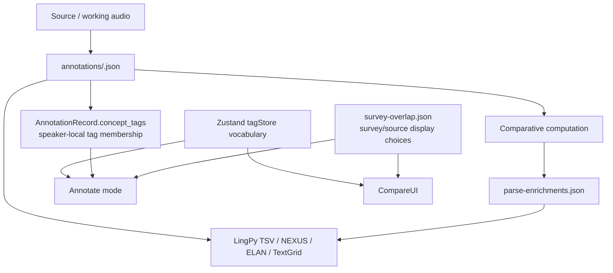
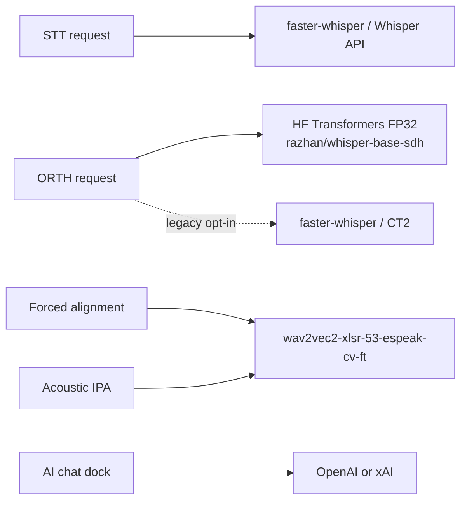
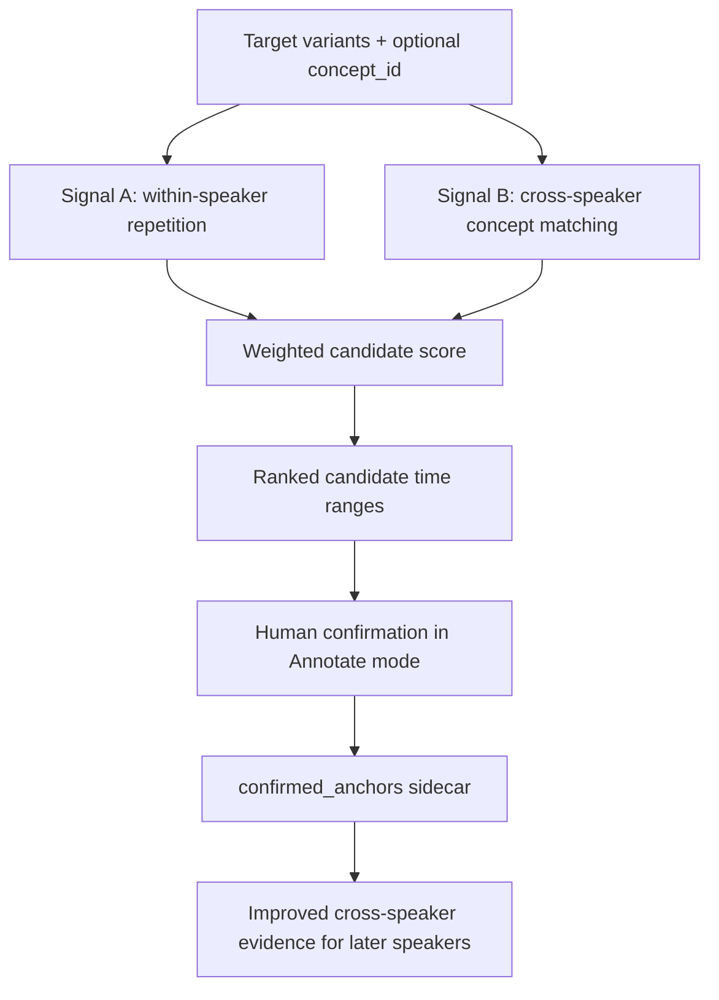
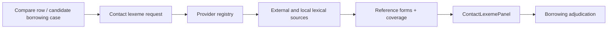

# Architecture & Data Model

> Last updated: 2026-05-07
>
> This document summarizes the current PARSE system shape: the unified React shell, Python backend, hybrid data model, Lexical Anchor Alignment System, CLEF provider registry, and export flow.

PARSE is a research workstation rather than a single-purpose annotator. Its architecture is designed to keep per-speaker timing work, cross-speaker comparison, AI-assisted workflows, and export pipelines in one coherent system.

## System overview

```mermaid
flowchart LR
    Browser[React + Vite frontend\nAnnotate / Compare / Tags / AI Chat] --> Client[src/api/client.ts\nbarrel]
    Client --> ClientContracts[src/api/contracts/*\nconcrete request helpers]
    ClientContracts --> Server[python/server.py\nthin HTTP orchestrator]
    Server --> Routes[python/server_routes/*\nroute-domain modules]
    Routes --> Annotations[annotations/<Speaker>.json\nper-speaker annotation records]
    Routes --> Enrichments[parse-enrichments.json\ncomparative overlays + notes]
    Server --> ChatRegistry[python/ai/chat_tools.py\nregistry/orchestrator]
    ChatRegistry --> ChatModules[python/ai/tools/* +\npython/ai/chat_tools/*]
    Server --> Compare[python/compare/*\ncognates + CLEF providers]
    Server --> Providers[python/ai/provider.py\nbase provider surface]
    Providers --> ProviderModules[python/ai/providers/*\nconcrete providers]
    Server --> Stream[WebSocket sidecar\nPARSE_WS_PORT + /ws/jobs/{jobId}]
    Server --> External[OpenAPI 3.1 + HTTP MCP bridge\n/openapi.json + /api/mcp/*]
    ChatRegistry --> MCP[python/adapters/mcp_adapter.py\nthin stdio entrypoint]
    MCP --> MCPModules[python/adapters/mcp/*\ntransport + schema + dispatch]
    External --> PyPkg[python/packages/parse_mcp\nLangChain / LlamaIndex / CrewAI wrappers]
    Compare --> Exports[LingPy TSV + NEXUS]
```

## Unified dual-mode shell

The current frontend architecture is **React + Vite** with a unified shell hosted in `ParseUI.tsx`.

That shell brings together:

- **Annotate mode** for per-speaker segmentation and review
- **Compare mode** for cross-speaker comparative analysis
- the shared **tag system**
- the **action menu** and compute workflows
- the built-in **AI chat dock**

This is a major architectural choice: PARSE does not treat annotation, comparison, and workflow assistance as separate apps. The same project state is reused across modes.

### Current runtime routes

Preferred development routes:

- `http://localhost:5173/` — Annotate
- `http://localhost:5173/compare` — Compare

After `npm run build`, the Python backend can also serve the built frontend at:

- `http://localhost:8766/`
- `http://localhost:8766/compare`

## Frontend structure

The rebuild still presents a stable top-level shell, but several high-traffic files are now **barrels** or thin shells rather than the concrete implementation homes they used to be.

Key examples:

- `src/api/client.ts` — barrel only; concrete helpers live under `src/api/contracts/`
- `src/stores/annotationStore.ts` — barrel only; concrete slices/helpers live under `src/stores/annotation/`
- `src/components/compute/ClefConfigModal.tsx`, `ClefSourcesReportModal.tsx`, `ClefPopulateSummaryBanner.tsx` — barrels only; concrete UI modules live under `src/components/compute/clef/`
- `src/components/compare/BorrowingPanel.tsx`, `ConceptTable.tsx`, `LexemeDetail.tsx`, `CognateControls.tsx` — barrels only; concrete UI modules live under `src/components/compare/compare-panels/`
- `src/components/annotate/AnnotateView.tsx`, `AnnotateMode.tsx`, `AnnotationPanel.tsx`, `LexemeSearchPanel.tsx` — barrels only; concrete UI modules live under `src/components/annotate/annotate-views/`
- `src/hooks/useWaveSurfer.ts` and `src/hooks/useBatchPipelineJob.ts` — barrels only; concrete hook pieces live under `src/hooks/wave-surfer/` and `src/hooks/batch-pipeline/`

For the current file-by-file layout, use [Post-decomp File Map](./architecture/post-decomp-file-map.md). Frontend-specific UI contracts, including sidebar grouped-variant visibility, live in [Frontend Architecture](./frontend-architecture.md).

## Backend design

The backend is centered on `python/server.py`, but that file is now deliberately a **thin orchestrator**.

Most concrete route behavior lives in `python/server_routes/`:

- `annotate.py`
- `compare.py`
- `jobs.py`
- `exports.py`
- `config.py`
- `clef.py`
- `chat.py`
- `media.py`
- `tag_filtered_rerun.py` — thin shim that wires `POST /api/concepts/by-tag` and `POST /api/lexemes/rerun-by-tag` into the orchestrator and delegates resolution + run logic to `python/app/http/tag_filtered_rerun_handlers.py` and `python/app/services/tag_resolver.py`

Cross-survey concept linking lives in two backend modules outside `server_routes/` but reachable through `server.py`:

- `python/concept_linking.py` — automatic on-import linking (strict canonical-gloss match) plus the per-concept `POST` / `DELETE /api/concepts/{conceptId}/survey-links` CRUD against the `concept_survey_links` sidecar
- `python/concept_relink.py` — `POST /api/concepts/relink-by-gloss` dry-run + apply over canonical-gloss groups, with backups of `concepts.csv`, `parse-enrichments.json`, and any annotation files it touches; restores backups on apply failure

`python/server.py` is still responsible for:

- startup and shared runtime wiring
- serving workspace configuration
- reading and writing annotation records through the route layer
- managing background-job registries and shared polling/log infrastructure
- publishing additive WebSocket job events through the sidecar endpoint
- coordinating auth, OpenAPI, and HTTP MCP serving
- serving the built frontend for non-dev/local-server usage

The backend is not just a thin file server. It is the orchestration layer for PARSE's workflow-specific automation, while `python/server_routes/` now owns most HTTP-domain logic.

## Hybrid data architecture

PARSE uses a layered data model rather than a single monolithic database.



### 1. Live annotations

Primary speaker-level data lives in:

- `annotations/<Speaker>.json`
- or the canonical `.parse.json` variant where present

These files are the primary source of truth for time-aligned annotation work.

The current README emphasizes an important rule: timestamps are not treated as disposable AI output. Timing remains central to the review workflow.

### 2. Computed enrichments

Comparative overlays live in:

- `parse-enrichments.json`

This layer stores computed comparative structures such as:

- cognate sets
- similarity signals
- borrowing-related overlays
- lexeme notes
- manual overrides layered onto computed output, including `canonical_realizations` for A/B/C form picks, `concept_merges` for compare-row grouping, cognate-set edits, and speaker flags

The point of the enrichments layer is to preserve comparative structure without collapsing the original annotation record into a purely derived format. Source-item grouping is derived from `concepts.csv` fields (`source_item`, `source_survey`, `custom_order`), while canonical realizations and concept merges live in `parse-enrichments.json` so review choices stay reversible and do not mutate source concepts or annotation tiers. Concept merges are Compare-mode-only: Annotate continues to expose raw concept rows so fieldwork navigation, tagging, and interval editing stay grounded in the source concept ids.

### 3. Tags and speaker-local concept membership

The tag vocabulary is shared across Annotate and Compare, but concept membership is now speaker-local.

- The reusable tag definitions remain in the Zustand-backed `tagStore` persistence layer.
- Per-speaker concept membership lives in `AnnotationRecord.concept_tags`, keyed by concept id with tag-id arrays. Empty memberships are omitted during normalization so blank sidecars do not pollute new records.
- Annotate tag filters/counts are scoped to the active speaker; confirming or flagging concept `1` on one speaker does not mark concept `1` as confirmed for every other speaker.

### 4. Transcript, survey, and analysis sidecars

PARSE also depends on supporting artifacts such as:

- `coarse_transcripts/<speaker>.json`
- `peaks/<Speaker>.json`
- optional import/legacy transcript CSVs
- `source_index.json`
- `survey-overlap.json`, which stores survey labels/colors, concept-to-survey source-item links, color-coding enablement, and per-speaker survey choices

These are not the same thing as the main annotation truth, but they materially support search, alignment, import, and visualization.

## Workspace-first design

PARSE can run directly from the repo, but its architecture is explicitly workspace-friendly.

When `PARSE_WORKSPACE_ROOT` is set, runtime writes and imports should land in that workspace rather than the bare repository tree.

This matters because PARSE is designed for:

- copied source audio
- imported processed artifacts
- persistent chat memory
- iterative fieldwork data preparation

In other words, the architecture assumes the active research workspace may be larger and more dynamic than the git checkout itself.

## AI provider architecture

PARSE routes different tasks to different provider families.



### ORTH backend choice (2026-05-01)

ORTH now defaults to `ortho.backend = "hf"` ([PR #218](https://github.com/ArdeleanLucas/PARSE/pull/218)), implemented by `HFWhisperProvider`
with Hugging Face Transformers FP32 PyTorch on `razhan/whisper-base-sdh`. The
first load may download roughly 280 MB into the standard Hugging Face cache at
`~/.cache/huggingface/`. The legacy CT2 path remains selectable with
`ortho.backend = "faster-whisper"` and a local CTranslate2 `ortho.model_path`,
but it is no longer recommended for Razhan SDH ORTH: on Lucas's RTX 5090,
HF Transformers was 16x faster on Saha01 and eliminated the 35.7% Latin /
Cyrillic / CJK contamination seen in the CT2 path.

The shipped HF provider uses low-level `WhisperProcessor` +
`WhisperForConditionalGeneration.generate()` rather than the high-level
pipeline. Full-file ORTH is chunked into 30-second windows; in-memory/concept
clips carry explicit sample rates and are resampled to 16 kHz when needed;
concept-window timing comes from the caller-supplied concept interval rather
than Whisper timestamp returns. Generated-token logprobs feed confidence, while
`compression_ratio_threshold`, `no_repeat_ngram_size`, `repetition_penalty`,
`condition_on_previous_text`, deterministic sampling flags, and explicit
caller-supplied prompt ids provide the anti-cascade guard surface. Current
full-file, concept-window, and per-lexeme HF ORTH callers pass no configured
prompt by default; callers must intentionally opt in if they want seeded
decoding. Legacy `compute_type` and VAD keys remain accepted in config for CT2
compatibility but are logged as ignored by HF.

This separation is important conceptually:

- speech recognition is not conflated with orthographic transcription
- orthographic transcription is not conflated with IPA generation
- workflow chat is not treated as the engine of alignment or export logic

## Lexical Anchor Alignment System

The **Lexical Anchor Alignment System** is the core PARSE feature for locating repeated lexical items in long recordings.

### Problem it solves

Long elicitation recordings often contain:

- conversational framing
- interviewer prompts
- repeated productions
- metalinguistic commentary
- ambient noise

A purely manual search process does not scale well across many speakers and concepts.

### Two-signal candidate ranking



#### Signal A — within-speaker repetition detection

PARSE looks for repeated phonetically similar forms within a short time window. This is motivated by elicitation behavior where the same target form may be repeated several times in succession.

#### Signal B — cross-speaker concept matching

PARSE compares unassigned material against verified annotations from other speakers for the same concept using exact, fuzzy, phonetic-rule, and positional strategies.

#### Current confidence formula

```text
confidence = 0.50 × phonetic + 0.25 × repetition + 0.15 × positional + 0.10 × cluster
```

The positional component uses a 45-second tolerance window around the expected cross-speaker median timestamp.

### Human-in-the-loop design

Architecturally, this system is ranking-and-review, not auto-commit.

The annotator verifies a candidate, adjusts boundaries if needed, and explicitly confirms it. Confirmed anchors are then written to `AnnotationRecord.confirmed_anchors[concept_id]`, strengthening the cross-speaker signal for the remaining speakers.

## CLEF provider registry

**CLEF** (Contact Lexeme Explorer Feature) is the contact-language evidence layer used during borrowing adjudication in Compare mode.

It is implemented as a provider registry under `python/compare/providers/`.

### Registry shape

The current registry exposes a 10-provider stack in this priority order:

- `csv_override`
- `lingpy_wordlist`
- `pycldf`
- `pylexibank`
- `asjp`
- `cldf`
- `wikidata`
- `wiktionary`
- `literature`
- `grok_llm`

`grok_llm` is the xAI/Grok LLM fallback. It runs last after citable/local providers and is not a Grokipedia.com scrape/provider.

Recent CLEF hardening added exact doculect matching for local CLDF/Lexibank-style data, source/provenance reporting, provider-warning surfacing, form-selection persistence, and `POST /api/clef/clear` / `clef_clear_data` reset support.

### Architectural role of CLEF



CLEF is intentionally separated from the main annotation store. It augments comparison with external evidence rather than overwriting the primary annotation record.

## Concept-scoped pipeline reruns

The annotation compute layer now supports three run modes across HTTP, frontend batch orchestration, MCP workflow macros, and the public `parse_mcp` typings:

- `full` — whole-speaker behavior, preserved as the default.
- `concept-windows` — process concept-tier windows, optionally narrowed by `concept_ids`.
- `edited-only` — process only concept-tier rows marked `manuallyAdjusted`, optionally narrowed by `concept_ids`.

Non-full backend results include `affected_concepts` so the React workstation can refresh rows touched by a scoped rerun without repainting unrelated concept rows. This scoped refresh is advisory: after IPA, ORTH, STT, or BND compute completion, the workstation still reloads the completed speaker annotation from disk so persisted tier writes are canonical. The frontend run preview also carries `runMode` into its cell computation: concept-window and edited-only IPA cells may be runnable despite stale full-mode `ipa.can_run=false` when ORTH/concept-tier presence is observable, while full mode and pure-empty concept-window speakers stay blocked. Empty edited-only requests return a no-op payload rather than scheduling an empty background job. Concept-window STT/ORTH/IPA deliberately avoid English concept/gloss `initial_prompt` seeding where Whisper-style decoding is involved and resolve language from request payload or annotation metadata before falling back to auto-detect. Concept-window / edited-only STT, ORTH, and IPA action-menu runs plus single-lexeme ORTH/IPA rerun endpoints share the pad vocabulary `0.0`, `0.2`, `0.5`; the pad widens acoustic context only, leaving reviewed interval bounds stable. Single-lexeme rerun endpoints are now tracked compute jobs (`lexeme_rerun_ortho` / `lexeme_rerun_ipa`) by default; `async=false` is legacy synchronous compatibility only.

## Tag-filtered concept queries and reruns

Tag-filtered concept queries and reruns reuse the same scoped-rerun machinery but choose the concept set by tag membership rather than by `concept_ids` or `manuallyAdjusted` flags. The split between resolution and execution lives in:

- `python/app/services/tag_resolver.py` — pure helpers: `resolve_tag_labels` against the global tag vocabulary, `expand_speakers` (`"all"` or an explicit list, validated against the workspace), and `select_concepts_by_tag` walking one normalized annotation record once with `match='any' | 'all'` semantics.
- `python/app/http/tag_filtered_rerun_handlers.py` — pure handler factories that take dependency callables for project root, annotation reads, audio resolution, per-interval ORTH/IPA runners, job creation, and annotation writes. They build the read-only `POST /api/concepts/by-tag` response and validate `POST /api/lexemes/rerun-by-tag`; default reruns create compute job `lexemes_rerun_by_tag` and return `202 + jobId`, while `async=false` preserves the deprecated blocking result shape.
- `python/server_routes/tag_filtered_rerun.py` — thin shim that wires the two handlers into the HTTP orchestrator with the actual server callables (`_annotation_read_path_for_speaker`, `_normalize_annotation_record`, `_pipeline_audio_path_for_speaker`, the `_run_ortho_interval` / `_run_ipa_interval` runners, and `locks_dir()`).

Two contract decisions worth surfacing:

- `match='all'` rejects unknown or ambiguous tag labels with HTTP 400 before resolving any concept hits. An AND query against a partially-resolved tag set would silently degrade to "intersection over the resolved subset," which is not what the caller asked for.
- The rerun route additionally rejects ambiguous labels with HTTP 409 even under `match='any'`, because silently disambiguating would consume GPU and overwrite annotations on a concept set the caller never explicitly approved. The error message lists the candidate ids so the caller can resubmit by id once that contract ships in a future iteration.

The job runner and deprecated `async=false` compatibility path eventually call the same per-interval handlers (`build_post_run_ortho_response`, `build_post_run_ipa_response`), so they inherit the same speaker-lock semantics, 60-second window cap, and pad vocabulary as `/api/lexeme/run_*`. Per-concept errors are collected into `results[*]` (`status: "error"`, original `statusCode`, message) without aborting the batch, so a single locked speaker or a stray missing concept does not lose the rest of the rerun work. Successful tagged rerun writes are persisted back into the active annotation record; ORTH writes rebuild affected `tiers.ortho_words`, and the selected lexeme word is chosen from overlapping Tier-2 words by midpoint distance, overlap, confidence, then original order.

## Compute cancellation, GPU lifecycle, and lock recovery

The compute layer now separates user-visible queue cancellation from backend
resource cleanup:

- `POST /api/compute/{jobId}/cancel` sets a thread-safe cooperative cancel flag.
  HF ORTH checks the flag between full-file chunks and concept windows. If some
  windows have already written intervals, the result can be `partial_cancelled`
  with `cancelled_at_interval` metadata; if no intervals were written, it can be
  `cancelled`.
- The React batch runner stops polling immediately when the user cancels, marks
  the current speaker cancelled, skips remaining speakers, and fire-and-forget
  posts the backend cancel request. Late successful poll payloads are discarded.
- Full-pipeline ORTH provider ownership is explicit: `_compute_full_pipeline`
  threads the provider into ORTH/concept-window calls instead of relying on a
  global `_LAST_ORTHO_PROVIDER`. IPA-only full-pipeline selections do not create
  ORTH, and cleanup stays in local `try/finally` ownership.
- Before IPA starts in a full-pipeline run, HF ORTH unloads its model/processor,
  clears/synchronizes CUDA cache, and a tunable 4 GiB free-memory guard protects
  wav2vec2 IPA from colliding with a still-resident Whisper model. `Aligner.release()`
  frees wav2vec2 state after IPA.
- Startup and `POST /api/locks/cleanup` perform non-destructive stale `*.lock`
  cleanup using JSON lock metadata (`creator_pid`, `created_at_unix`, `speaker`).
  Dead or legacy metadata-less locks can be deleted; live-PID locks are skipped;
  old live-PID locks get a manual-review reason; no cleanup path kills processes.

## Chat tool architecture

The in-app assistant works through `python/ai/chat_tools.py` (registry/orchestrator; concrete tool modules live under `python/ai/tools/` and `python/ai/chat_tools/`).

Current counts:

- **60** built-in PARSE chat tools
- **60** default MCP task tools via `python/adapters/mcp_adapter.py` (thin MCP entrypoint; concrete adapter modules live under `python/adapters/mcp/`)
- **64** total default MCP adapter tools including 3 workflow macros + `mcp_get_exposure_mode`
- **44** total legacy curated opt-out tools when `config/mcp_config.json` sets `{ "expose_all_tools": false }`

This separation matters architecturally:

- the browser assistant can use the broader tool surface
- external MCP clients get the full safe task surface by default, with a legacy curated opt-out available through `expose_all_tools=false`
- the system stays bounded to PARSE-specific workflows rather than arbitrary shell access

## Export architecture

PARSE's export layer exists to carry reviewed annotation and comparative decisions into downstream analysis.

Current export paths mentioned in the README and code include:

- LingPy TSV
- NEXUS
- annotations CSV
- ELAN XML
- Praat TextGrid

These exports are downstream products of the annotation + enrichment layers rather than independent sources of truth.

## Design principles visible in the current architecture

Several design principles recur across the current implementation:

1. **Timestamps remain central** — PARSE is not a text-only annotation tool
2. **Human review stays explicit** — automation ranks, pre-fills, or computes, but confirmation remains visible
3. **Modes share one workspace** — Annotate and Compare are not disconnected applications
4. **AI is task-routed** — different providers handle different kinds of work
5. **Research outputs matter** — export is part of the architecture, not an afterthought

## Related docs

- Setup and runtime details: [Getting Started](./getting-started.md)
- User workflow walkthrough: [User Guide](./user-guide.md)
- Provider and tool surface details: [AI Integration](./ai-integration.md)
- Extension points and project layout: [Developer Guide](./developer-guide.md)
