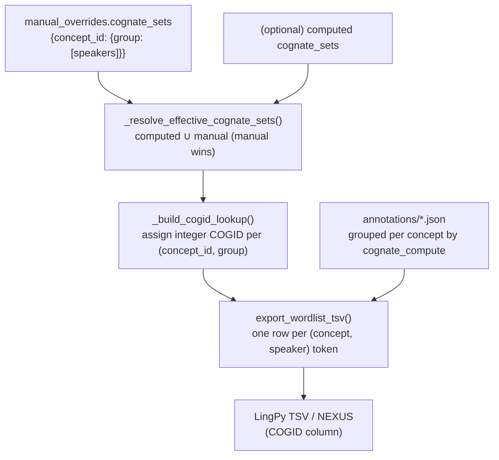

# Cognate sets → phylogenetic matrix: data flow and invariants

This document explains how manual cognate decisions in a PARSE workspace become the
cognate-class matrix (LingPy TSV / NEXUS) that feeds phylogenetic inference. It exists
because the *format* of the export is documented elsewhere, but the *behavior* — how
decisions are stored, merged, and folded into cognate IDs — was not, and that gap has
repeatedly led to false "drift" alarms (see the case study in §5).

**TL;DR**

- Cognate decisions live in `parse-enrichments.json` under
  `manual_overrides.cognate_sets`, keyed by **concept id**.
- At export time they are merged with any computed sets, then turned into integer
  **COGID**s per `(concept_id, group_letter)`.
- The wordlist is built **per concept**, and cognate lookup **folds survey-overlap
  duplicate ids together** — so a concept elicited under two ids (e.g. tooth = `255`
  and `529`) is one cognate character, not two.
- **COGIDs are arbitrary sequential labels.** Only the *partition* (which forms share a
  COGID within a concept) is meaningful. Re-running renumbers them; that is not a change.
- Therefore the **number of keys** in `cognate_sets` (e.g. whether redundant duplicate
  ids are present) does **not** change the matrix. Key-count differences between two
  copies of the data are cosmetic, not a correctness bug.

---

## 1. Where the data lives

| Artifact | Location | Role |
|---|---|---|
| `cognate_sets` | `parse-enrichments.json` → `manual_overrides.cognate_sets` | The committed cognate decision: `{concept_id: {group_letter: [speaker, …]}}`. This is what the matrix reads. |
| `borrowing_flags` | `manual_overrides.borrowing_flags` (+ top-level parity copy) | Per-(concept, speaker) loan flag → the `BORROWING` column. |
| `discarded_forms` | `manual_overrides.discarded_forms` (+ top-level) | Tokens excluded from coding. |
| (optional) computed `cognate_sets` | top-level `cognate_sets` | An automated clustering pass, if present. Overlaid by the manual sets (manual wins). |

Some projects also keep a curated authoring copy outside the live store (e.g. a
`state_decisions*/` directory with `sk_cognate_sets_*.json`, a decision-report CSV, and
summary notes). Those are **inputs to** `manual_overrides`; only `manual_overrides` is
read by the matrix code. A sync step projects the authoring copy into
`manual_overrides` — but see §5: that projection's exact key set does not affect the
matrix.

`representative_state` and the human reasoning notes are **not** stored in
`manual_overrides` and are **not** read by the matrix. They are review/annotation
metadata (which state is the native "anchor" for display, and why). Changing a
representative does not change the matrix; it changes only the per-concept label/exemplar.

---

## 2. The pipeline



All three functions live in `python/compare/cognate_compute.py`; the legacy review
export path is in `python/export_review_data.py`.

### 2.1 Resolve the effective sets

`_resolve_effective_cognate_sets(enrichments)` starts from the top-level computed
`cognate_sets` (often empty) and overlays `manual_overrides.cognate_sets` key-by-key, so
**manual decisions win**. The result is the single map the rest of the pipeline uses.

### 2.2 Assign COGIDs

`_build_cogid_lookup(cognate_sets)` walks the concept ids in sorted order and, for each
non-empty `(concept_id, group_letter)`, hands out the next integer from a global counter:

```python
cogid_lookup[(concept_id, group_label)] = next_cogid
next_cogid += 1
```

It also builds `group_lookup[concept_id] = {speaker: group_letter}`.

**Consequence — COGIDs are arbitrary.** They are positional labels, not stable
identifiers. Their only job is to be *equal within a cognate class and distinct across
classes, per concept*. Inserting or removing a concept id earlier in sort order shifts
every later COGID by a constant; the cognate *partition* is unchanged. Do not compare
raw COGID integers across two runs or two copies of the data and conclude anything from
a mismatch.

### 2.3 Build the wordlist

`export_wordlist_tsv()` iterates **annotation concepts** and emits one row per speaker
token:

```python
for concept_id in sorted(forms_by_concept.keys(), …):
    concept_groups = cogid_group_by_speaker.get(concept_id, {})
    for record in forms_by_concept[concept_id]:
        group_label = concept_groups.get(speaker_key, "")
        cogid = cogid_lookup.get((concept_id, group_label), 0) if group_label else 0
```

A token whose concept has no committed group for that speaker gets `COGID = 0`
(uncoded). That is expected for any concept that has not been cognate-coded — it is not
an error.

---

## 3. The fold-by-concept invariant

PARSE concepts are often elicited under **more than one survey id** (survey overlap): the
same meaning carries several numeric ids, e.g. tooth = `255` *and* `529`, tongue = `257`
*and* `530`, red = `90`/`166`/`386`. See `docs/plans/MC-338-survey-overlap.md` and
`docs/cross-survey-concept-linking-plan.md` for the linking model.

Different consumers handle this overlap differently — and this is a real behavioral
distinction, not a uniform invariant:

- **Display / review export** (`export_review_data.py`): concepts are matched across
  surveys by **stem** (normalized label), gathering each speaker's tokens from *all*
  matched ids, and the cognate class is looked up by the canonical concept
  (`_cognate_class_for` → `_enrichment_keys`, which tries `concept_id` then the label).
- **Compare bundles** (`compare_bundles.py`): rows are "grouped by a normalized stem,"
  and survey links resolve duplicate ids to one bucket.
- **LingPy / NEXUS export, default mode** (`export_wordlist_tsv`, `build_nexus`):
  keys strictly by `concept_id` and does **not** fold survey-overlap ids — each coded
  id becomes its **own** character block. So *big* committed under both `53` and `150`
  yields two character blocks unless consolidation is requested.
- **LingPy / NEXUS export, consolidated mode** (`consolidate` / `conceptTag`, via
  `python/compare/consolidated_matrix.py`): folds survey-overlap duplicate ids into one
  canonical character (byte-identical `safe_union` columns only; divergent columns are
  kept separate with a warning). See
  [`phylogenetic-export-pipeline.md`](./phylogenetic-export-pipeline.md) §3.

So for the **default** LingPy/NEXUS path, a gloss committed under multiple ids appears
multiple times in the matrix; request **consolidation** to fold them into one canonical
character.

---

## 4. What is NOT read by the matrix

To avoid confusion, these are review/metadata and have **no** effect on the COGID matrix:

- `representative_state` — the native "anchor" state for a concept (policy: a loan is
  never the sole representative). Display/label only.
- Human reasoning / summary notes.
- The exact key *count* of `cognate_sets` (see §5).

These **do** affect the matrix:

- The cognate **partition** for each concept (which speakers share a group).
- `borrowing_flags` → `BORROWING` column.
- Which tokens exist in the annotations (a token absent from the annotations cannot be
  coded).

---

## 5. Case study: "cognate_sets has 101 keys here and 113 there" is NOT a drift bug

A common false alarm: two copies of the decisions have different key counts in
`cognate_sets` — e.g. a live store with **101** concept ids and an authoring copy with
**113** — and the extra 12 are survey-overlap **duplicate** ids (`170, 362, 386, 527,
528, 529, 530, 532, 535, 540, 547, 611`), each identical to a primary sibling that is
already present.

Running the real exporter (`export_wordlist_tsv`) against both produces:

- **Identical row count.**
- **Identical coded-vs-uncoded split** (same number of `COGID = 0` rows).
- **Identical cognate partition** (the same speakers share a class within each concept).
- The *only* difference: COGID integers are **renumbered** by a constant offset, because
  inserting 12 keys earlier in sort order bumps later counters (§2.2).

In other words, the duplicate ids are **redundant** for the matrix: resolution already
folds by concept (§3), so the primary id covers every speaker. Adding or removing them
changes arbitrary labels, not the data.

**Guidance:** Do not treat a `cognate_sets` key-count difference as a correctness bug, and
do not "fix" it by hand-editing keys. If you want the two copies byte-identical for
tidiness, run the project's sync step — but know it has no effect on the exported matrix.
A *real* cognate-data difference is a difference in **membership** (a speaker in a
different group, or present/absent), or in `borrowing_flags` / `discarded_forms` — those
do change the output. Diff the **partition**, not the key list.

---

## 6. Troubleshooting

| Symptom | Likely cause | Action |
|---|---|---|
| `COGID` column all `0` / all distinct | No committed cognate decisions in `manual_overrides.cognate_sets` | Commit decisions via the UI compare flow or `enrichments_write`; preview with `cognate_compute_preview`. |
| COGID integers differ between two exports | Different key count or sort order → renumbering (§2.2) | Not a bug. Compare the partition, not the integers. |
| A concept appears "twice" in analysis | The default LingPy/NEXUS export keys by `concept_id` and does **not** fold survey-overlap duplicate ids (§3) | Request consolidation — pass `consolidate: true` (or `conceptTag`) to `export_lingpy_tsv` / `export_nexus` / `export_complete_lingpy_dataset`. See [`phylogenetic-export-pipeline.md`](./phylogenetic-export-pipeline.md). |
| One speaker uncoded for a concept others have | That speaker's token is tagged under a duplicate id the decision wasn't written to **and** the canonical id's membership doesn't include them | Verify the canonical concept's group membership includes the speaker (folding relies on the primary id carrying the full set). |

---

## 7. Code references

- `python/compare/cognate_compute.py` — `_resolve_effective_cognate_sets`,
  `_build_cogid_lookup`, `export_wordlist_tsv`.
- `python/export_review_data.py` — `_cognate_class_for`, `_enrichment_keys`, the
  stem-matched legacy export loop.
- `python/compare_bundles.py` — stem grouping + survey-overlap resolution.
- Export format & tooling: `docs/agent-skills/parse-mcp-tools/skills/export/export_lingpy_tsv.md`,
  `docs/agent-skills/parse-mcp-tools/skills/comparison/cognate_compute_preview.md`.
- Survey overlap model: `docs/plans/MC-338-survey-overlap.md`,
  `docs/cross-survey-concept-linking-plan.md`.
