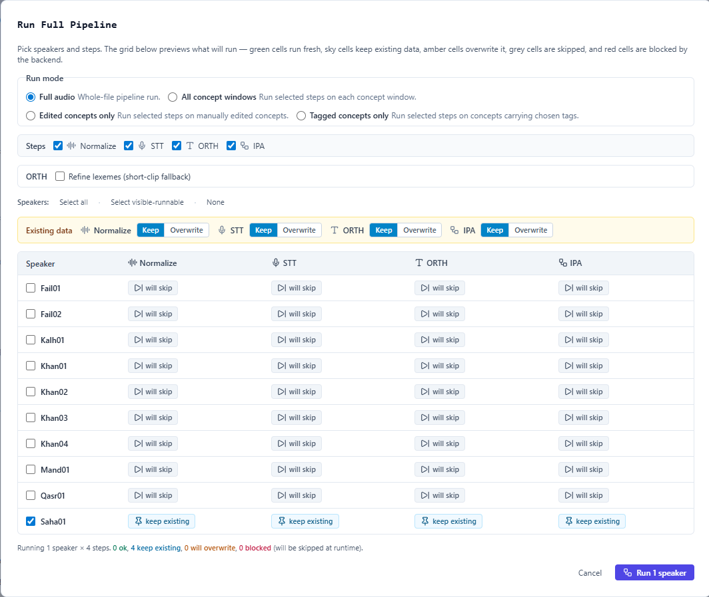

# First full pipeline run

This guide walks through one conservative end-to-end run for a single speaker. It is designed for a new user who wants to verify that PARSE can read audio, create intervals, and produce reviewable STT, ORTH, and IPA outputs.

## Before you start
1. Complete [Installation](../installation.md).
2. Launch PARSE with `./scripts/parse-run.sh`.
3. Open the Annotate view from the printed URL.
4. Confirm your workspace contains a source WAV and any available CSV/TSV markers.

## Recommended first run

  

*Figure: the **Run Full Pipeline** modal collects every step in one surface. Pick one speaker, leave all four steps (Normalize, STT, ORTH, IPA) checked, keep the default **Keep** existing-data toggles, and inspect the preview grid before clicking **Run** to make sure nothing already-finalized gets overwritten.*

1. **Import or open one speaker.** Use a short representative recording before batching a corpus.
2. **Generate or verify boundaries.** Confirm the waveform, peaks, and lexical intervals line up with the source audio.
3. **Run STT.** For long files, PARSE reports chunk progress and keeps merged transcript timing in the usual cache shape.
4. **Run ORTH.** Review the orthographic tier and adjust intervals before accepting downstream IPA.
5. **Run IPA.** Treat IPA as a review aid; inspect any coverage-shrink warning before overwriting prior IPA coverage.
6. **Save and re-open the speaker.** Confirm annotations and enrichments persist from disk.
7. **Export a small sample.** Use LingPy TSV or another export to verify downstream shape before full corpus work.

## What success looks like
- The job strip reaches a terminal state instead of spinning indefinitely.
- Batch/report rows show either success or a clear partial/error state.
- `annotations/<Speaker>.parse.json` contains the reviewed tiers.
- Long runs identify failed chunk spans instead of returning one opaque failure.

## If something fails
- Read [Troubleshooting common issues](../troubleshooting/).
- For long recordings, use [Troubleshooting long files](../troubleshooting/long-files.md).
- Check [Environment variables](../reference/environment-variables.md) before changing chunk or device behavior.
