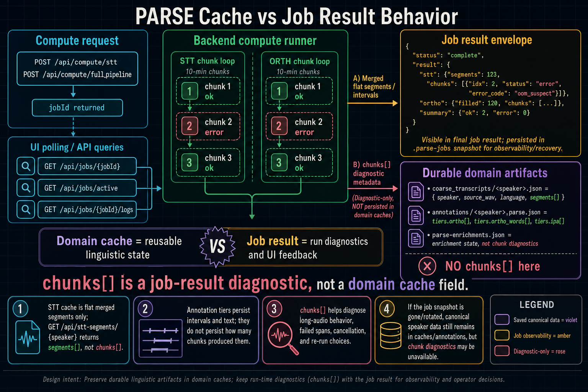

# MCP schema and authentication model

This document describes the standardized external-agent surface added in Task 5.
For the narrative overview of the four surfaces, tool counts, auth model, and `parse-mcp` usage, see [MCP & External API Guide](mcp-guide.md).

## External surfaces

PARSE now exposes three closely related machine-facing surfaces:

1. **HTTP API** on port `8766`
   - browser workstation backend
   - documented via OpenAPI 3.1
2. **HTTP MCP bridge** on the same server
   - schema discovery and tool execution for Python wrappers
3. **stdio MCP adapter**
   - `python/adapters/mcp_adapter.py` (thin MCP entrypoint; concrete adapter modules live under `python/adapters/mcp/`)
   - for Claude Code, Cursor, Codex, Cline, Hermes, Windsurf, and other MCP-capable clients

## OpenAPI endpoints

- `GET /openapi.json`
- `GET /docs`
- `GET /redoc`

## HTTP MCP bridge endpoints

- `GET /api/mcp/exposure`
  - returns the active exposure configuration and tool counts
- `GET /api/mcp/tools`
  - returns the active tool catalog with full parameter schemas, annotations, and `x-parse` safety metadata
- `GET /api/mcp/tools/{toolName}`
  - returns one tool schema
- `POST /api/mcp/tools/{toolName}`
  - executes one MCP-visible PARSE tool via HTTP

### Exposure modes

`mode` query parameter accepts:
- `active` — obey `config/mcp_config.json` / `mcp_config.json` (`expose_all_tools=false` preserves the legacy curated opt-out surface)
- `default` — use the shipped default MCP surface from `DEFAULT_MCP_TOOL_NAMES`
- `all` — expose the full tool surface

Verified current counts from `python/ai/chat_tools.py`, `python/ai/workflow_tools.py`, and `python/adapters/mcp_adapter.py`:
- **60** built-in `ParseChatTools`
- **60** default MCP task tools from `DEFAULT_MCP_TOOL_NAMES`
- **3** workflow macros from `python/ai/workflow_tools.py`
- **64** total default adapter tools including read-only `mcp_get_exposure_mode`
- **64** total adapter tools when `expose_all_tools=true`
- **40** legacy curated opt-out task tools from `LEGACY_CURATED_MCP_TOOL_NAMES`
- **44** total adapter tools when `config/mcp_config.json` explicitly sets `expose_all_tools=false`

The shipped default includes the BND-facing tools `compute_boundaries_start`, `compute_boundaries_status`, `retranscribe_with_boundaries_start`, and `retranscribe_with_boundaries_status`, plus write-capable `clef_clear_data`, `csv_only_reimport`, and `revert_csv_reimport`. The boundary-constrained STT compute path also accepts the alias `bnd_stt`, but `bnd_stt` is an HTTP/worker compute alias rather than a separately registered MCP tool name.

## Tool schema shape

Each listed tool includes:
- `name`
- `family`
  - `adapter`
  - `chat`
  - `workflow`
- `description`
- `parameters`
  - strict JSON schema derived from `ChatToolSpec.parameters`
- `annotations`
  - standard MCP hints such as `readOnlyHint`
- `meta.x-parse`
  - PARSE-specific safety metadata:
    - `mutability`
    - `supports_dry_run`
    - `dry_run_parameter`
    - `preconditions`
    - `postconditions`

## Authentication model

### HTTP API transport auth
PARSE's local HTTP API is **not bearer-protected** today. It is designed for local workstation use on `127.0.0.1:8766` / `localhost:8766` with permissive CORS for the browser UI and local automation.

### Provider credential auth
Provider credentials are managed locally through:
- `GET /api/auth/status`
- `POST /api/auth/key`
- `POST /api/auth/start`
- `POST /api/auth/poll`
- `POST /api/auth/logout`

Supported auth methods currently include:
- direct API-key storage for xAI/OpenAI-style providers
- OpenAI device/OAuth flow

Credentials are stored in local `config/auth_tokens.json` and mirrored into the live process environment when needed.

### MCP auth
The stdio MCP adapter does not add a separate network auth layer. Access is controlled by the local process launch context and environment, especially:
- `PARSE_PROJECT_ROOT`
- `PARSE_EXTERNAL_READ_ROOTS`
- `PARSE_CHAT_MEMORY_PATH`
- `PARSE_API_PORT`
- `PARSE_PORT`

## Recommended external-agent workflow

1. Read `GET /api/mcp/exposure`
2. Discover tools from `GET /api/mcp/tools`
3. Inspect `meta.x-parse.preconditions` and `supports_dry_run`
4. Prefer `dryRun=true` for mutating tools when available
5. Execute via `POST /api/mcp/tools/{toolName}`
6. Use normal HTTP endpoints or MCP-specific polling/status helpers as needed

## Compute job result shapes

Compute status tools and HTTP polling endpoints return a generic job snapshot while a job runs. When a job reaches `status == "complete"`, the snapshot carries a `result` object. MC-384 adds chunk-aware and device-aware fields to those result objects.

### Generic completed job snapshot

```json
{
  "jobId": "compute-7f3a",
  "type": "compute:full_pipeline",
  "status": "complete",
  "progress": 100,
  "message": "Compute complete",
  "error": null,
  "result": {
    "speaker": "Khan01",
    "steps_run": ["stt", "ortho", "ipa"],
    "results": {}
  }
}
```

Agents should treat the top-level job `status` and the per-step result status separately. A full-pipeline job can complete while one step reports `status: "error"`, `"skipped"`, `"cancelled"`, or `"partial_cancelled"` inside `result.results.<step>`.

### Shared MC-384 fields

| Field | Type | Producers | Description |
| --- | --- | --- | --- |
| `chunks` | `ChunkResult[]` | Full-file STT, full-mode ORTH | Per-chunk diagnostics. Empty array for short/single-shot paths. Present only in job results; not persisted to STT cache. |
| `device` | string | STT, ORTH, IPA | Resolved/effective compute device. This is the shipped wire key for what PR notes may call `resolved_device`. |
| `coverage_shrink_warning` | object | IPA overwrite path | Optional warning that an IPA overwrite produced much shorter projected coverage than the existing IPA tier. |
| `duration_sec` | number | STT | Source audio duration used to decide whether STT should chunk. |

### `ChunkResult`

| Field | Type | Required | Description |
| --- | --- | --- | --- |
| `idx` | integer | yes | Zero-based chunk index. |
| `span` | object `{idx?: integer, start: float, end: float}` | yes | Audio-global seconds. Adjacent chunks satisfy `chunks[i].span.end == chunks[i+1].span.start`. |
| `status` | enum: `ok` / `error` / `skipped` / `cancelled` | yes | Per-chunk outcome. |
| `error_code` | enum or string | required when `status='error'` | Machine-readable recovery code. Known values are listed below. |
| `error` | string | required when `status='error'` | Human-readable error message. |

### Known error codes

| Code | Meaning | Agent retry guidance |
| --- | --- | --- |
| `oom_suspect` | Memory pressure suspected. Existing full-pipeline preflight semantics are preserved and extended to chunk-level results. | Retry the failed stage with a smaller chunk size (`PARSE_STT_DEFAULT_CHUNK_MINUTES` or `PARSE_ORTH_DEFAULT_CHUNK_MINUTES`), or fall back to scoped reprocessing where available. |
| `chunk_failed` | Chunk failed for a non-memory reason that did not match a more specific code. | Retry the specific span once; if it repeats, surface the chunk span to the user and continue with the partial result. |
| `provider_error` | Provider/model raised an unexpected exception. | Do not blind-loop. Check provider configuration/logs, switch provider if available, or run a scoped retry. |
| `timeout` | Subprocess or chunk exceeded its time budget. | Retry the affected chunk with a smaller chunk size or adjust `PARSE_COMPUTE_SUBPROCESS_TIMEOUT_SEC` after verifying the machine is healthy. |
| `server_restarted` | Durable job snapshot was recovered after backend restart before terminal completion. | Reconcile disk artifacts, then rerun only the missing step. |

### STT result

Full-file STT (`stt_start`, `stt_word_level_start`, or full-pipeline STT) returns:

| Field | Type | Description |
| --- | --- | --- |
| `speaker` | string | Speaker ID. |
| `sourceWav` | string | Resolved source/working WAV path. |
| `language` | string or null | Language hint used for the provider, or null for auto-detect. |
| `segments` | array | Merged flat STT segments in audio-global time. Words may be present depending on the STT mode. |
| `chunks` | `ChunkResult[]` | Empty for short/single-shot paths; one entry per long-file chunk otherwise. |
| `duration_sec` | number | Duration used for chunking decisions. |
| `device` | string | Effective STT device. |
| `status` | optional enum | Present for cancellation or error-shaped results. |

Cache rule: `coarse_transcripts/<speaker>.json` stores the merged flat `segments[]` only. `chunks[]` is a job-result diagnostic envelope and is intentionally not cached.



*Figure: The cache stays backward-compatible for normal STT readers. Chunk rows are diagnostic evidence for the just-run job, so agents and power users should read job results/reports when they need per-chunk recovery details.*

Short-audio STT example:

```json
{
  "speaker": "Short01",
  "sourceWav": "audio/working/Short01/Short01.wav",
  "language": "sdh",
  "segments": [{"start": 0.4, "end": 2.1, "text": "..."}],
  "chunks": [],
  "duration_sec": 60.0,
  "device": "cuda"
}
```

Long-audio STT example with one failed chunk:

```json
{
  "speaker": "Fail01",
  "segments": [{"start": 0.5, "end": 599.0, "text": "..."}],
  "chunks": [
    {"idx": 0, "span": {"idx": 0, "start": 0.0, "end": 600.0}, "status": "ok"},
    {"idx": 1, "span": {"idx": 1, "start": 600.0, "end": 1200.0}, "status": "error", "error_code": "oom_suspect", "error": "CUDA out of memory"},
    {"idx": 2, "span": {"idx": 2, "start": 1200.0, "end": 1800.0}, "status": "ok"}
  ],
  "duration_sec": 1800.0,
  "device": "cuda"
}
```

### ORTH result

Full-mode ORTH returns:

| Field | Type | Description |
| --- | --- | --- |
| `speaker` | string | Speaker ID. |
| `device` | string | Effective ORTH device. |
| `filled` | integer | Coarse Tier-1 intervals populated. |
| `total` | integer | Coarse intervals attempted/written. |
| `ortho_words` | integer | Tier-2 word-level intervals written. |
| `refined_lexemes` | integer | Optional short-clip refinement additions. |
| `status` | optional enum | `cancelled` / `partial_cancelled` when cancellation interrupts. Omitted or stage-specific success fields indicate normal success. |
| `chunks` | `ChunkResult[]` | Empty for short/single-shot paths; one entry per long-file chunk otherwise. |

ORTH persists merged annotation tiers (`tiers.ortho`, `tiers.ortho_words`) rather than a chunk cache. Tier 2 forced alignment runs once after Tier-1 chunks merge.

### IPA result and coverage warning

IPA does not chunk by whole-audio duration. It operates over STT/ORTH/concept intervals. Full-mode or scoped IPA results can include:

| Field | Type | Description |
| --- | --- | --- |
| `speaker` | string | Speaker ID. |
| `device` | string | Effective wav2vec2/IPA device. |
| `filled`, `skipped`, `total` | integer | Interval-level counts. |
| `ortho_source` | string | Source tier used for IPA windows (`ortho_words`, `ortho`, or `concept`). |
| `skip_breakdown` | object | Structured skip reasons. |
| `exception_samples` | string[] | Bounded exception examples for diagnosis. |
| `coverage_shrink_warning` | object | Optional overwrite warning. |

`coverage_shrink_warning` shape:

```json
{
  "previous_end": 8000.0,
  "projected_end": 1200.0,
  "previous_count": 420
}
```

The warning is advisory: the job can still complete. Agents should surface it prominently before declaring an overwrite run healthy.

### MCP tool guidance

- `stt_status` / `stt_word_level_status` can expose STT `result.chunks` and `result.device` once terminal.
- `compute_status` is the canonical poller for `pipeline_run`, ORTH, IPA, and full-pipeline compute jobs. Inspect both `result.summary` and `result.results.<step>.chunks`.
- `pipeline_run` and `run_full_annotation_pipeline` do not change their start payloads for MC-384; chunking and subprocess isolation are selected by backend intent/duration/env.
- `job_logs` remains the diagnostic companion when a chunk reports `oom_suspect`, `provider_error`, or `timeout`.

Backward compatibility: callers that do not read `chunks[]`, `device`, or `coverage_shrink_warning` can continue to consume the previous top-level result fields.
