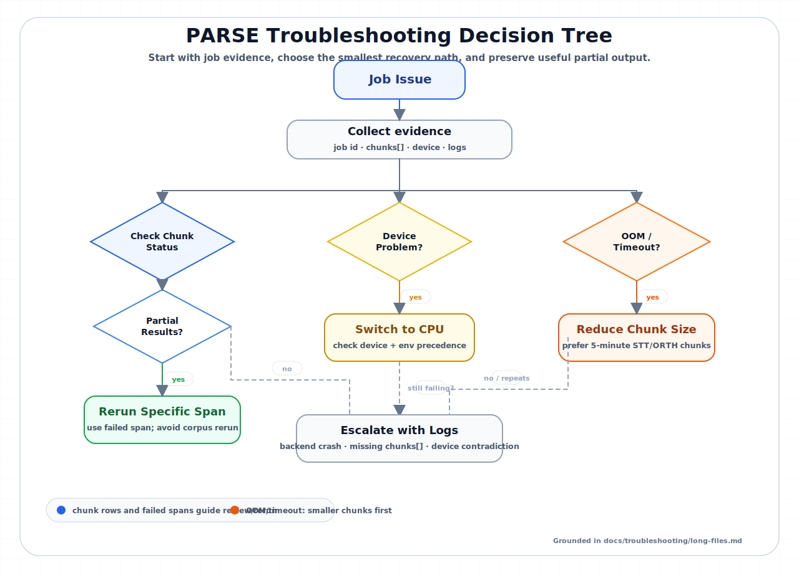

# Troubleshooting common issues

Start with the symptom, then choose the smallest fix that preserves useful work. Most PARSE failures fall into three buckets: startup, long-file processing, or configuration/device mismatch.

*Figure: Start with the job evidence, then choose the smallest recovery path. Partial chunk results point to a failed span; device mismatch points to CPU fallback; repeated OOM/timeout points to smaller STT/ORTH chunks before broader reruns.*

## Quick symptom index

| Symptom | First place to look | First action |
|---|---|---|
| Long recording stalls, partially completes, or OOMs | [Troubleshooting long files](long-files.md) | Do not start a duplicate job; collect job id, chunks, logs, and device. |
| Output ends far before the WAV end | [Troubleshooting long files](long-files.md#symptom-stt-or-orth-stopped-early) | Check coverage and failed spans before Compare/export. |
| IPA got much shorter after rerun | [IPA coverage troubleshooting](long-files.md#symptom-ipa-coverage-looks-much-smaller-after-rerun) | Inspect upstream STT/ORTH intervals before accepting overwrite output. |
| API or Vite does not start | [Getting Started troubleshooting](../getting-started.md#troubleshooting) | Check ports, launcher output, and `parse-logs api` / `parse-logs vite`. |
| GPU unexpectedly falls back to CPU | [Device selection](../architecture/device-selection.md) and [Environment variables](../reference/environment-variables.md) | Check `device` in the result and relevant `PARSE_*_DEVICE` env vars. |
| Job result has `chunks[]`, `partial`, or `coverage_shrink_warning` | [Job result schema](../reference/job-results.md) | Use the span/status fields to decide whether to rerun, repair, or accept provisionally. |
| Agent/MCP automation sees an unexpected result shape | [MCP schema](../mcp/schema.md) | Compare the actual terminal job result with the schema examples. |

## What to collect before reporting a bug

Look first in the header job strip and the batch report details. Expand partial/error cells to reveal chunk rows and failed spans.

- Speaker id/name and workspace root.
- UI action or command that started the job.
- Stage: STT, ORTH, IPA, full pipeline, concept-window, or edited-only.
- Job id and terminal status.
- Any `chunks[]` rows, especially failed `span`, `status`, `error_code`, and `error`.
- Reported `device` for the stage.
- Relevant `parse-logs api` lines or `job_logs` output.
- Whether you changed chunk size, timeout, or CPU/GPU settings.

Good reports make bugs reproducible and prevent unnecessary full-corpus reruns.
