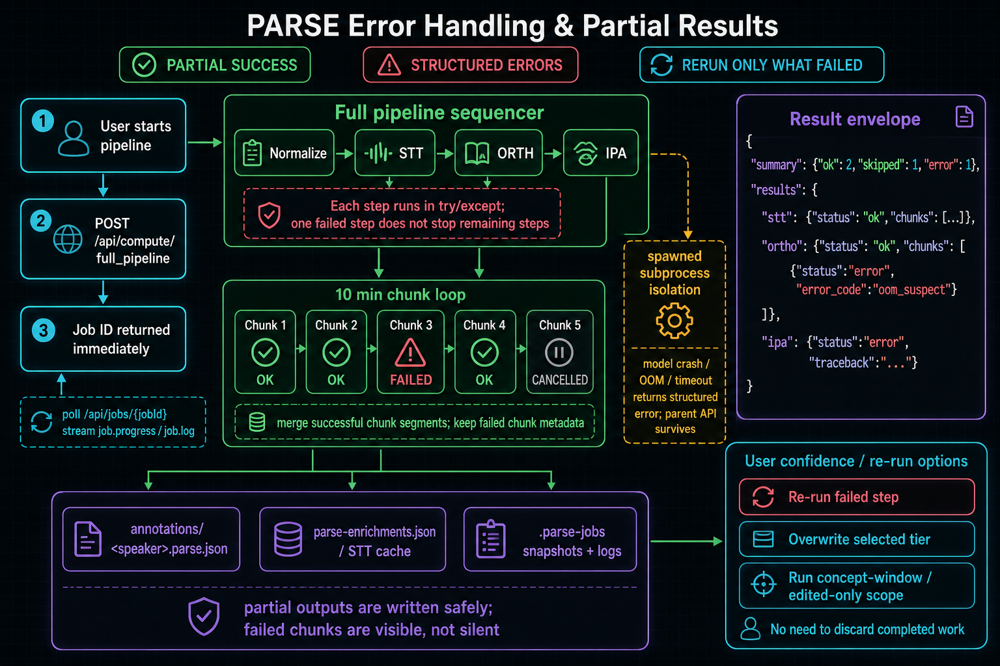

# Troubleshooting long files

> Last updated: 2026-05-14. Use this page when long STT/ORTH/IPA jobs stall, stop early, consume too much memory, or return partial chunk results. For the normal workflow, start with [Processing long recordings](../user-guides/processing-long-recordings.md).

## First checks

Before changing settings, collect these facts:

1. Speaker name and stage: STT, ORTH, IPA, or full pipeline.
2. Recording duration and whether it is full-file or concept-window/edited-only.
3. Current chunk settings:
   ```bash
   PARSE_STT_DEFAULT_CHUNK_MINUTES
   PARSE_ORTH_DEFAULT_CHUNK_MINUTES
   ```
4. Job id from the header strip, batch report, MCP result, or `/api/jobs/active`.
5. `chunks[]` rows from the job result when present.
6. The relevant `job_logs` lines and any traceback from the batch report.
7. Resolved stage `device` from the result or completion logs.

A long-file bug is much easier to fix when you know whether the failure is one chunk, one stage, one provider, or the whole server.

## Triage map: where did the problem happen?

Use this map before changing settings:

```text
Long-file problem
      |
      v
Did the backend stay alive?
      |
      +-- no  -> collect backend logs; this is a crash-containment bug
      |
      +-- yes -> is there a job result or batch row?
                    |
                    +-- no  -> inspect active jobs / API connectivity
                    |
                    +-- yes -> does it include chunks[]?
                                  |
                                  +-- no  -> maybe short/scoped path, disabled chunking,
                                  |         or wrong compute route
                                  |
                                  +-- yes -> inspect first non-ok chunk span,
                                            error_code, and device
```

Quick interpretation:

| What failed? | What it usually means | First useful action |
|---|---|---|
| One chunk | Local audio/model/provider issue in that span. | Inspect the `span`; rerun the stage with smaller chunks if memory/loop shaped. |
| Many chunks with the same code | Machine, model, device, or config issue. | Check `device`, model paths, memory, and env vars before rerunning. |
| Whole stage but backend alive | Stage-level provider/config failure or timeout. | Read `job_logs`; rerun only that stage after correcting the cause. |
| Backend died | Isolation gap or parent-process failure. | Preserve logs and escalate; do not keep starting duplicate jobs. |
| UI lost contact but backend alive | Browser/API polling issue or stale job strip. | Query job status directly and wait/cancel from the real job state. |



*Figure: A partial result preserves useful output and points to failed spans. Treat the failed chunk as a review target, not as proof that the whole recording must be discarded.*

## Common fixes in plain language

| Symptom | Plain-language meaning | Try this first |
|---|---|---|
| "STT stopped early" | The transcription model got stuck or gave up in one region. | Keep chunking on; lower STT chunks to 5 minutes; rerun STT for that speaker. |
| "ORTH failed around a long recording" | The rough transcription pass likely used too much memory or hit a bad slice. | Lower ORTH chunks to 5 minutes; rerun ORTH; inspect the failed span. |
| "Chunk failed: oom_suspect" | A model probably ran out of RAM/VRAM or was killed. | Close heavy apps; run one speaker; use smaller chunks; consider CPU fallback. |
| "Chunk failed: timeout" | A worker exceeded the timeout or stopped making progress. | Check logs first; smaller chunks are usually safer than a larger timeout. |
| "Very slow" | The system may be on CPU, loading models, or doing many small chunks. | Check `device`; benchmark one chunk; avoid multi-speaker batches on laptops. |
| "IPA got shorter" | IPA follows intervals; upstream coverage may have shrunk. | Inspect STT/ORTH/concept intervals before accepting the IPA rerun. |

## Symptom: STT or ORTH stopped early

Likely causes:

- Whisper/faster-whisper decoder repetition loop or hallucination on one region.
- A provider call raised and the older monolithic path returned only early segments.
- The recording has a corrupt/noisy region that causes one chunk to fail.
- Chunking was disabled, so one bad region affected the whole file.

What to check:

- Does the job result include `chunks[]`?
- Do later chunks have `ok` rows, or did output stop after the first failed chunk?
- Does `coverage_fraction` show partial coverage even though the tier has intervals?
- Do logs mention repeated tokens, compression-ratio filtering, timeout, or provider errors?

Recovery:

1. Keep chunking enabled or re-enable it if disabled.
2. Lower chunk size for the affected stage:
   ```bash
   PARSE_STT_DEFAULT_CHUNK_MINUTES=5 ./scripts/parse-run.sh
   # or
   PARSE_ORTH_DEFAULT_CHUNK_MINUTES=5 ./scripts/parse-run.sh
   ```
3. Rerun only the failed stage for that speaker.
4. If only one lexical item is bad, use a concept-window or per-lexeme rerun rather than reprocessing the whole recording.
5. Review the chunk span around the failure in Annotate mode before trusting downstream Compare output.

## Symptom: Chunk failed with OOM or timeout

Common codes:

| Code | Meaning | First recovery |
|---|---|---|
| `oom_suspect` | MemoryError, CUDA OOM, killed child, or similar memory-shaped failure. | Lower chunk size, close other model-heavy processes, or force the stage to CPU. |
| `timeout` | Child process exceeded the configured timeout or stopped making progress. | Inspect logs; lower chunk size before increasing timeout. |
| `provider_error` | Provider raised a non-OOM exception. | Check model path, language, audio validity, and traceback. |

OOM recovery options:

```bash
# Smaller chunks for both long-file stages
PARSE_STT_DEFAULT_CHUNK_MINUTES=5 \
PARSE_ORTH_DEFAULT_CHUNK_MINUTES=5 \
./scripts/parse-run.sh

# Keep only STT off GPU if STT competes with ORTH/IPA
PARSE_STT_DEVICE=cpu ./scripts/parse-run.sh

# Conservative fallback for unstable GPU stacks
PARSE_COMPUTE_DEVICE=cpu ./scripts/parse-run.sh
```

Timeout recovery options:

```bash
# Only after logs show a chunk is still progressing but needs more time
PARSE_COMPUTE_SUBPROCESS_TIMEOUT_SEC=21600 ./scripts/parse-run.sh
```

Do not increase timeout as the first response to an OOM-shaped failure. A smaller chunk is usually safer.

## Symptom: Very slow processing on long files

Expected causes:

- First chunk downloads/imports/warms a model.
- CPU fallback is active because CUDA is unavailable or explicitly disabled.
- Chunk size is very small, increasing provider-call overhead.
- IPA has many intervals; IPA cost often follows interval count more than total WAV duration.
- The outer persistent worker may keep orchestration warm, but nested heavy-stage subprocesses still spawn for crash containment.

What to check:

- Stage result `device` and completion logs.
- Whether `PARSE_COMPUTE_DEVICE` or stage-specific device env vars force CPU.
- Whether `wav2vec2.allow_wsl_cuda=false` is forcing IPA CPU.
- Chunk count: a 3-hour file is 18 chunks at 10 minutes, 36 chunks at 5 minutes.
- Disk location: slow network or cross-filesystem temp/audio paths can add overhead.

Recovery:

- For ordinary fieldwork, keep 10-minute chunks unless failures require smaller slices.
- Run one speaker/stage at a time on low-memory laptops.
- Use CUDA only when the local stack is stable; failed GPU runs often waste more time than predictable CPU runs.
- Benchmark a single 10-minute slice on the target machine before scheduling a whole corpus.

Planning expectations, not promises:

| Recording / machine | What is normal | When to worry |
|---|---|---|
| First 10-minute chunk on any machine | Slower than later chunks because models may load/import. | No logs, no job state, or backend unavailable. |
| 1-hour CPU-only laptop run | Can take several hours. | Progress never advances past startup or all chunks fail with the same provider error. |
| 2-3 hour CUDA workstation run | Long but practical; progress should advance by chunk. | Repeated OOM, device unexpectedly `cpu`, or coverage ends far before the audio end. |
| 4+ hour field recording | Treat as unattended long work; inspect reports carefully. | Any all-green status with implausibly tiny coverage should be audited before export. |

A useful rule of thumb: if one 10-minute chunk takes `X` minutes after warm-up, a three-hour file has about 18 chunks, so the stage may take roughly `18 × X` minutes plus merge/alignment overhead. IPA is harder to estimate because it follows interval count, not simple audio duration.

## Symptom: IPA coverage looks much smaller after rerun

Likely cause:

- IPA is interval-driven. If the upstream ORTH/STT/concept coverage is now shorter, the IPA rerun may cover less audio than the previous IPA tier.
- The new IPA shrink guard returned `coverage_shrink_warning`.

What to check:

- `coverage_shrink_warning.previous_end`
- `coverage_shrink_warning.projected_end`
- `coverage_shrink_warning.previous_count`
- Current ORTH/concept intervals for the speaker.
- Whether STT/ORTH stopped early or returned partial/empty output before IPA ran.

Recovery:

1. Do not sign off the IPA tier just because the job status is `ok`.
2. Inspect upstream STT/ORTH coverage first.
3. Rerun or repair the missing upstream intervals.
4. Rerun IPA only after the interval inventory is plausible.
5. If you intentionally narrowed the review scope, record that decision in notes so later export reviewers understand why coverage shrank.

Disable the warning only for a controlled workflow where shrinkage is expected:

```bash
PARSE_IPA_SHRINK_WARN_THRESHOLD_SEC=0 ./scripts/parse-run.sh
```

## Symptom: No progress shown in the UI for a long job

Possible causes:

- The job is still in startup/model-load before the first chunk message.
- The browser lost `/api` connectivity after the backend job started.
- The backend is busy but the header strip has already dismissed a terminal job snapshot.
- The job is running through an older path or untracked process.

What to check:

1. Refresh `/api/jobs/active` or use the MCP `jobs_list_active` / `job_status` tools.
2. If the batch row says **Lost contact after start**, preserve the backend `jobId` and inspect that job directly.
3. Check API logs with `parse-logs api`.
4. Check whether the backend is still alive at `/api/config`.
5. Look for chunk progress lines such as `STT chunk N/M` or `ORTH chunk N/M` in logs.

Recovery:

- Do not start a duplicate long job until you know whether the original job is still running.
- If the backend restarted, job snapshots may mark interrupted work as `server_restarted`.
- If the job is alive but slow, wait for the current chunk to finish or cancel cooperatively before changing settings.

## Symptom: Memory usage is higher than expected

Important points:

- Chunking bounds per-call audio duration, but models still occupy memory.
- Nested subprocesses reduce parent-process crash risk; they do not make the model free.
- GPU memory and host memory can both matter.
- Temporary WAV chunks and merged result data use disk and memory.

Recovery on 16 GB machines:

1. Run one speaker at a time.
2. Prefer 5-minute chunks after any OOM.
3. Close browsers, IDEs, and other model processes before starting long runs.
4. Avoid running STT, ORTH, and IPA for multiple speakers in one unattended batch.
5. Use `PARSE_STT_DEVICE=cpu` or `PARSE_COMPUTE_DEVICE=cpu` when CUDA instability is the real blocker.
6. Keep the workspace on a fast local disk when possible.

## How to interpret `chunks[]`

A chunk result describes one attempted span of a long full-file STT or full-mode ORTH job.

Typical shape:

```json
{
  "idx": 2,
  "span": {"idx": 2, "start": 1200.0, "end": 1800.0},
  "status": "error",
  "error_code": "oom_suspect",
  "error": "CUDA out of memory"
}
```

Fields:

| Field | Meaning |
|---|---|
| `idx` | Zero-based chunk index. The UI may display this as a human row number. |
| `span.start` / `span.end` | Audio-global seconds for the attempted slice. Use this to find the failed region in Annotate mode. |
| `status` | `ok`, `error`, or `cancelled` depending on the stage/path. |
| `error_code` | Machine-readable class such as `oom_suspect`, `timeout`, or `provider_error`. |
| `error` | Human-readable message or traceback excerpt. |

Where it appears:

- STT job result: `result.chunks[]`
- Full pipeline result: `result.results.stt.chunks[]` and/or `result.results.ortho.chunks[]`
- Batch report: expandable per-stage chunk details
- MCP/API status responses: `compute_status`, `job_status`, or stage-specific status tools

Where it does **not** appear:

- `coarse_transcripts/<speaker>.json` STT cache. That cache remains a flat merged `segments[]` list.
- A separate ORTH chunk cache. ORTH writes merged annotation tiers.

## Disabling chunking safely

Disabling chunking returns STT/ORTH to the old single-shot style for that stage. This is useful for controlled debugging, not normal fieldwork.

```text
Default safe path
long recording -> chunks -> partial/ok/error rows -> merged result

Disabled chunking
long recording -> one large provider call -> one answer or one large failure
```

Only disable chunking when:

- You are comparing old and new behavior on a controlled recording.
- A developer asks for a monolithic reproduction.
- The file is short and you want to remove the chunking gate from a test.

Commands:

```bash
# Disable STT duration chunking only
PARSE_STT_DEFAULT_CHUNK_MINUTES=0 ./scripts/parse-run.sh

# Disable ORTH duration chunking only
PARSE_ORTH_DEFAULT_CHUNK_MINUTES=0 ./scripts/parse-run.sh

# Disable both for a controlled benchmark
PARSE_STT_DEFAULT_CHUNK_MINUTES=0 PARSE_ORTH_DEFAULT_CHUNK_MINUTES=0 ./scripts/parse-run.sh
```

Safety checklist before disabling chunking on a long recording:

1. Save or note the current workspace state.
2. Run only one speaker/stage, not a whole corpus batch.
3. Watch memory/VRAM if possible.
4. Keep the previous chunked report so you can compare coverage.
5. Re-enable chunking for normal fieldwork after the experiment.

## When to ask for developer help

Escalate with logs when:

- The backend dies instead of returning a structured job error.
- The same chunk fails with `provider_error` on multiple chunk sizes.
- `chunks[]` is missing for a long full-file STT/ORTH path where default chunking should have fired.
- The UI says complete but no tiers/caches changed.
- The reported `device` contradicts env/config precedence.
- A job remains active indefinitely and does not respond to cooperative cancellation.

Include the speaker, job id, chunk settings, `chunks[]`, relevant `job_logs`, and whether the run was full-speaker, full-pipeline, concept-window, or edited-only.

## Related docs

- [Processing long recordings](../user-guides/processing-long-recordings.md)
- [Compute architecture](../architecture/compute.md)
- [Environment variables](../environment-variables.md)
- [MCP schema: compute job result shapes](../mcp-schema.md#compute-job-result-shapes)
